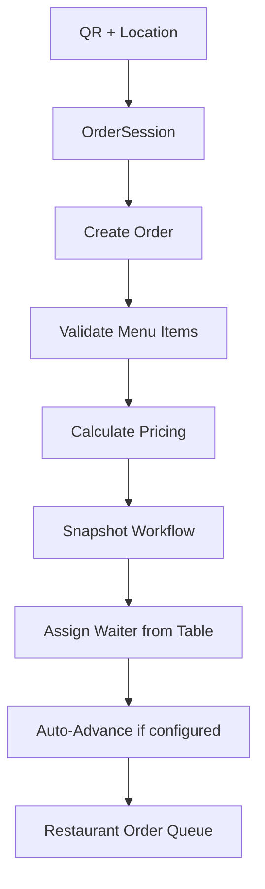

# Loyalty Backend — Hardened Ordering Foundation & Core Order System

Welcome to the Loyalty Backend project! This repository contains the backend systems, APIs, database models, security rules, and real-time Jest integration tests that drive customer loyalty cards, stamp programs, push notifications, menu administration, and physical ordering sessions.

This project implements a concurrency-safe **Ordering Entry Infrastructure**, a customized **Order Workflow Validator**, and the **Core Order System** with table-based waiter assignment and dynamic workflow auto-advance.

---

## Technical Architecture Map

The project separates administrative configuration capabilities (owner-only) from operational execution tasks (employee-only) and customer access (customer-only).



---

## Workflow Validation & Role Isolation

### 1. Role Capabilities
Permissions are checked at two layers:
- **`ROLE_PERMISSIONS` (config/permissions.js)**: Defines what an employee role is fundamentally capable of.
- **`workflowStep.actionRoles`**: Defines which capable roles may perform a transition for a given restaurant's custom workflow.

The workflow system never grants a capability that an employee role fundamentally lacks in `ROLE_PERMISSIONS`.

| Employee Role | Assigned Capabilities | Operational Actions Allowed |
|---|---|---|
| **chef** | `orders:view`, `orders:prepare`, `orders:ready` | Preparation and declaring orders ready. |
| **waiter** | `orders:view`, `orders:serve` | Delivering and serving orders. |
| **cashier** | `orders:view`, `orders:payment`, `loyalty:stamps:add` | Finalizing billing and adding stamps. |

### 2. Workflow Boundaries & Validation Rules
Owners configure custom steps, subject to strict server validation:
- **First Enabled Step**: Must always be `'placed'`.
- **Last Enabled Step**: Must always be `'completed'`.
- **Order values**: Must be positive, finite, integers (`Number.isInteger(order) && order > 0`).
- **Required steps**: `'placed'` and `'completed'` cannot be disabled.
- **System immutability**: System-controlled fields (`key`, `systemState`, `required`) are immutable.

### 3. Skipped Steps & Dynamic Transition Overrides
If a restaurant chef does not interact with the system when food becomes ready, the owner can disable the `'ready'` step:
```text
placed ➔ preparing ➔ completed
```
The transition system dynamically checks permissions based on the *next* active step in the sequence, allowing waiters to advance preparing orders directly to completed (using their `'orders:serve'` capability).

---

## Core Order Features

### 1. Table-Based Waiter Assignment
- Owners assign waiters to tables (`PATCH /api/restaurants/:restaurantId/tables/:tableId/waiter` or `PATCH /api/restaurants/:restaurantId/table-assignments`).
- When a customer places an order, the server verifies and snapshots the table's assigned waiter into the order.
- Reassigning tables only affects future orders. Active/historical order records remain unchanged.
- Deactivating an employee automatically clears all their table assignments.

### 2. Fresh Location Verification
A customer may check in, get a session, and walk away. Therefore, when submitting `POST /api/orders`, the customer must supply a **fresh** geolocation reading. The backend performs a geofence verification on this fresh coordinate before creating the order ticket.

### 3. Server-Side Pricing Guard
The frontend cannot determine item prices, subtotals, or totals. It only submits `menuItemId` and `quantity`. The backend fetches items from the Mongoose sub-document `Menu` collection and calculates line totals, subtotals, and totals server-side.

### 4. Workflow Snapshotting & Auto-Advance
- When an order is created, the restaurant's active enabled `orderWorkflow` configuration is copied directly into the Order document.
- If the default workflow specifies `autoAdvance: true` on `'placed'`, the order creation timeline logs both `order_created` and `auto_started_preparation`, immediately advancing the order's state to `'preparing'`.

### 5. Idempotent Creator
To prevent duplicate orders on network retries, clients must send a unique `Idempotency-Key` header. Requests with duplicate keys will resolve to the existing order, avoiding duplicate ticket generation.

### 6. Queue Isolation & Wrong-Waiter Protection
- ** изолированный Queue**: Waiters only retrieve orders assigned to them in their active orders queue. Chefs and cashiers see all active orders restaurant-wide.
- **Access Control**: Only the assigned waiter can perform transitions from `ready`/`serving` steps. Other waiters attempting to advance the order receive a `403 ORDER_ASSIGNED_TO_ANOTHER_WAITER` error.

---

## Integration Testing

The project uses **Jest** and **Supertest** for fully awaited, deterministic integration testing against an isolated test database (`loyaltyAppTest` on MongoDB Atlas). 

Collections are wiped out between test runs to guarantee test isolation.

### Run Automated Tests
```bash
npm test
```

### Run Legacy Assertions
```bash
npm run test:legacy
```
