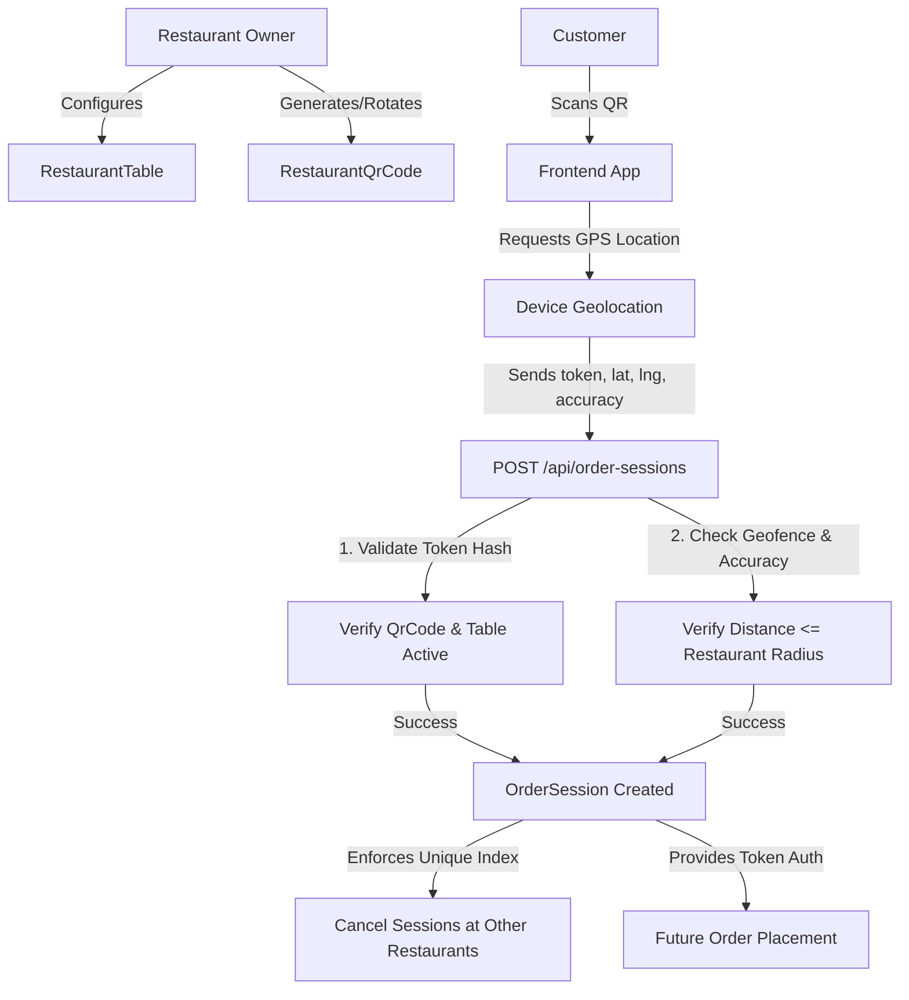

# Technical Documentation: Ordering Entry Infrastructure

This document details the software architecture, data models, cryptographic validations, geofencing rules, and API specifications introduced for the **Ordering Entry Infrastructure**.

---

## 1. System Architecture

The ordering entry flow acts as a gatekeeper to verify that a customer is physically present at a restaurant table before allowing them to view the menu, create an order session, or submit orders.



---

## 2. Database Schema and Relationships

### 2.1. RestaurantTable (`model/restaurantTable.js`)
Maps physical tables under a restaurant.
- **restaurant**: `ObjectId -> Restaurant` (indexed)
- **name**: `String` (e.g. `"Table 4"`, `"Bar Counter 2"`)
- **code**: `String` (trimmed, unique within the restaurant)
- **description**: `String` (optional context)
- **isActive**: `Boolean` (soft-deactivation support; default `true`)

*Unique Constraint*: Compound unique index on `{ restaurant: 1, code: 1 }`.

### 2.2. RestaurantQrCode (`model/restaurantQrCode.js`)
Secure representation of a table check-in QR credentials.
- **restaurant**: `ObjectId -> Restaurant` (indexed)
- **table**: `ObjectId -> RestaurantTable` (indexed)
- **tokenHash**: `String` (SHA-256 hash of the cryptographically generated raw token; unique and indexed)
- **isActive**: `Boolean` (deactivated upon rotation or revocation; default `true`)
- **createdBy**: `ObjectId -> User` (owner who generated the credential)
- **rotatedAt**: `Date` (timestamp of rotation)
- **revokedAt**: `Date` (timestamp of revocation)

### 2.3. OrderSession (`model/orderSession.js`)
Proves verified presence of a customer at a table.
- **customer**: `ObjectId -> User`
- **restaurant**: `ObjectId -> Restaurant`
- **table**: `ObjectId -> RestaurantTable` (indexed)
- **qrCode**: `ObjectId -> RestaurantQrCode`
- **status**: `String` (enum: `['active', 'expired', 'completed', 'cancelled']`; default `'active'`)
- **locationVerification**:
  - `accuracyMeters`: `Number`
  - `distanceMeters`: `Number` (calculated distance to restaurant)
  - `verifiedAt`: `Date`
- **expiresAt**: `Date` (indexed with a TTL rule for automatic database maintenance)
- **lastVerifiedAt**: `Date`

> [!NOTE]
> **Customer Privacy Guard**: Exact `latitude` and `longitude` coordinates of the customer are completely excluded from the OrderSession schema. Only the calculated distance and verification accuracy are retained for audit trail purposes.

---

## 3. Security Specifications

### 3.1. Cryptographic QR Verification
To prevent malicious users from forging QR URLs or guessing table parameters:
1. When an owner generates a QR code, the system generates a cryptographically secure raw token:
   `crypto.randomBytes(32).toString('hex')`
2. The server hashes the token using SHA-256:
   `crypto.createHash('sha256').update(token).digest('hex')`
3. Only the SHA-256 hash (`tokenHash`) is saved in MongoDB. The raw token is returned to the owner exactly **once** in the API response payload (to render the print QR URL) and is never printed in log files or exposed again.
4. When a customer scans a table QR, the raw token is submitted to `POST /api/order-sessions`. The backend hashes the input token and queries the matching active database record.

### 3.2. Geofence Distance & Radius-Aware Accuracy
Geofence compliance is calculated mathematically using the Haversine formula:

$$d = 2R \arcsin \left( \sqrt{\sin^2\left(\frac{\Delta \phi}{2}\right) + \cos(\phi_1)\cos(\phi_2)\sin^2\left(\frac{\Delta \lambda}{2}\right)} \right)$$

Where:
- \(\phi_1, \phi_2\) are latitudes of customer and restaurant in radians.
- \(\Delta \phi, \Delta \lambda\) are latitude and longitude differences in radians.
- \(R\) is Earth's mean radius (\(6,371,000\) meters).

#### Radius-Aware Accuracy Check
To prevent remote coordinate spoofing, the maximum permitted GPS uncertainty adapts dynamically to the restaurant's geofence boundaries:

$$\text{Maximum Allowed Accuracy} = \min(150\text{ meters}, \text{restaurant.orderingRadiusMeters})$$

If the device GPS reporting accuracy (in meters) exceeds this maximum allowed value, the check-in is rejected with `LOCATION_ACCURACY_TOO_LOW`.

### 3.3. Session Expiration & TTL
OrderSessions expire after **90 minutes** (`expiresAt`).
- Authorization checks explicitly verify `expiresAt > new Date()`.
- Expired documents are eventually removed from the database by Mongoose's TTL index configuration on `expiresAt` (configured with `expireAfterSeconds: 0`).
- Background TTL cleanup delay does not impact authorization: any active check verifies both `status === "active"` and `expiresAt > now`.

---

## 4. Session Conflict & Concurrency Safety Rules

### 4.1. Exclusivity Rules
- **Single Active Session**: A customer can only have one active `OrderSession` globally at any given time.
- **Auto-Refresh**: If a customer scans the same QR code at the same table and restaurant where they already have an active, non-expired session, the system automatically refreshes the session (extends the expiration by 90 minutes) rather than creating a duplicate document.
- **Cross-Restaurant Scan**: If a customer scans a table QR for a different restaurant while holding an active session, the previous session is immediately marked as `'cancelled'`, and a new session is created.

### 4.2. Database-Level Concurrency Guard
To guarantee safety against race conditions (e.g. concurrent HTTP requests creating two active sessions), a MongoDB unique partial index is defined on `customer`:

```js
orderSessionSchema.index(
  { customer: 1 },
  { unique: true, partialFilterExpression: { status: 'active' } }
);
```

When concurrent write requests are submitted:
1. One write succeeds and registers the active session.
2. The concurrent write fails with a duplicate key index violation (code 11000).
3. The controller intercepts code 11000:
   - If it is for the same table and restaurant, it automatically falls back to refreshing the existing active session.
   - If it is for a different table or restaurant, it returns an explicit `ORDER_SESSION_CONCURRENCY_CONFLICT` error.

---

## 5. QR Code Rotation vs Revocation Semantics

- **QR Rotation**: Invalidates the old QR token for issuing **new** sessions, but allows existing active sessions generated from that QR code to remain valid (so dining customers are not disconnected). The old QR record has `isActive: false` and `rotatedAt` timestamp set.
- **QR Revocation**: Invalidates the QR token for issuing new sessions **and** immediately invalidates all active sessions issued from it (e.g. if the QR code print was compromised or moved). The QR record has `isActive: false` and `revokedAt` timestamp set.

---

## 6. API Reference & Error Codes

### 6.1. Table Management (Owner Only)
- `POST /api/restaurants/:restaurantId/tables`: Creates a table.
- `GET /api/restaurants/:restaurantId/tables`: Lists all tables.
- `GET /api/restaurants/:restaurantId/tables/:tableId`: Gets table details.
- `PATCH /api/restaurants/:restaurantId/tables/:tableId`: Edits table details.
- `PATCH /api/restaurants/:restaurantId/tables/:tableId/deactivate`: Soft-deactivates table.
- `PATCH /api/restaurants/:restaurantId/tables/:tableId/activate`: Activates table.

### 6.2. QR Code Lifecycle (Owner Only)
- `POST /api/restaurants/:restaurantId/tables/:tableId/qr`: Generates a new active QR token.
- `GET /api/restaurants/:restaurantId/tables/:tableId/qr`: Lists QR metadata (rotated/revoked times).
- `PATCH /api/restaurants/:restaurantId/tables/:tableId/qr/rotate`: Rotates QR (invalidates old, generates new).
- `PATCH /api/restaurants/:restaurantId/tables/:tableId/qr/:qrCodeId/revoke`: Revokes QR (invalidates immediately).

### 6.3. Customer Order Sessions (Customer Only)
- `POST /api/order-sessions`: Validates QR & GPS, creates/refreshes an `OrderSession`.
- `GET /api/order-sessions/current`: Retrieves the active session.
- `POST /api/order-sessions/:sessionId/verify-location`: Re-verifies GPS before checkout.
- `POST /api/order-sessions/:sessionId/cancel`: Cancels the active session.

### 6.4. Error Codes

| Error Code | HTTP Status | Description |
|---|---|---|
| `TABLE_CODE_ALREADY_EXISTS` | 400 | The table code code is already taken in this restaurant. |
| `TABLE_INACTIVE` | 400 | The target table has been deactivated. |
| `QR_CODE_NOT_FOUND` | 404 | Hashed QR token could not be resolved. |
| `QR_CODE_INACTIVE` | 400 | The token has been invalidated by rotation. |
| `QR_CODE_REVOKED` | 400 | The token has been revoked by the owner. |
| `RESTAURANT_ORDERING_DISABLED` | 400 | Ordering is disabled for the restaurant. |
| `RESTAURANT_ORDERING_LOCATION_MISSING` | 400 | Restaurant has not configured geofence coordinates. |
| `INVALID_CUSTOMER_COORDINATES` | 400 | Latitude or longitude parameters are out of bound or NaN. |
| `LOCATION_ACCURACY_TOO_LOW` | 400 | Geolocation accuracy exceeds radius-aware thresholds. |
| `OUTSIDE_RESTAURANT_ORDERING_RADIUS` | 403 | Customer calculated distance exceeds geofence radius limits. |
| `ORDER_SESSION_NOT_FOUND` | 404 | Active session could not be retrieved. |
| `ORDER_SESSION_EXPIRED` | 400 | Session expiration time has elapsed. |
| `ORDER_SESSION_NOT_OWNED` | 403 | Customer attempts to access another customer's session. |
| `ORDER_SESSION_CONCURRENCY_CONFLICT` | 409 | Concurrent check-in collision detected. |
