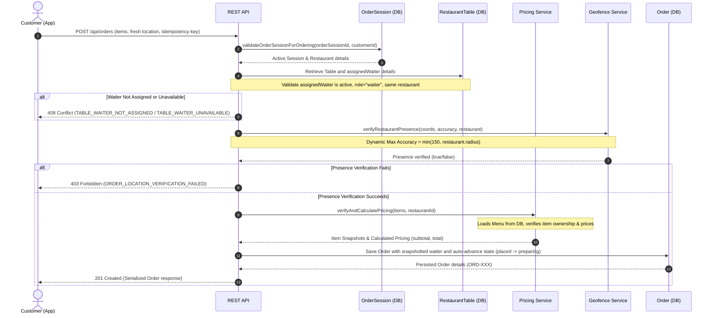

# Technical Documentation: Core Order System

This document describes the software architecture, database design, REST interfaces, and security rules for the **Core Loyalty Order System** module.

---

## 1. System Flow & Sequence Map

Order creation utilizes the validated `OrderSession` as a security boundary. It re-verifies the user's physical presence at the table with a fresh GPS geofence check, resolves and validates the table's assigned waiter, snapshots the waiter into the order, and handles automatic step progression.

---

## 2. Database Schema & Data Models

### 2.1. Order Schema (`model/order.js`)

Main transactional record. The exact fields are detailed below:

| Field Name | Type | Description |
|---|---|---|
| **orderNumber** | `String` | Human-readable sequential ID (e.g. `ORD-101`). Unique per restaurant. |
| **customer** | `ObjectId -> User` | Reference to the ordering customer. |
| **restaurant** | `ObjectId -> Restaurant` | Reference to the restaurant. |
| **table** | `ObjectId -> RestaurantTable` | Reference to the table. |
| **orderSession** | `ObjectId -> OrderSession` | Reference to the verified session boundary. |
| **items** | `[OrderItem]` | Snapshot list of selected menu items. |
| **pricing** | `Pricing` | Server-calculated subtotal, tax, discounts, and total. |
| **workflow** | `WorkflowSnapshot` | Copy of the restaurant workflow config at order creation time. |
| **currentStepKey** | `String` | Current active step in workflow (e.g. `'preparing'`). |
| **systemState** | `String` | Current step system mapping state: `OPEN`, `IN_PROGRESS`, `COMPLETED`, `CANCELLED`. |
| **kitchen** | `KitchenTracking` | Tracks timestamps and employees who started/readied cooking. |
| **service** | `ServiceTracking` | Tracks waiter assignment, assignment source, and service timestamps. |
| **payment** | `PaymentTracking` | Placeholder schema for unpaid/paid states and method. |
| **loyalty** | `LoyaltyTracking` | Placeholder schema for stamps earned and discount applied. |
| **customerNotes** | `String` | Freeform instructions submitted by the customer. |
| **cancellation** | `Cancellation` | Audit fields populated if the order ticket is cancelled. |
| **timeline** | `[TimelineEntry]` | Chronological history of all workflow advancements. |
| **idempotencyKey** | `String` | Unique string to guard against duplicate submissions. |

### 2.2. Sub-Schemas

- **OrderItem**: Stores a snapshot of `menuItemId`, `name`, `quantity` (validated in `[1, 50]`), `unitPrice` (loaded from DB), `lineTotal` (calculated as `unitPrice * quantity`), and optional `notes`.
- **Pricing**: Stores verified monetary metrics. Prevents client-side price manipulation.
- **WorkflowSnapshot**: Copy of the restaurant's active `orderWorkflow` step configurations (version, key, label, order, actionRoles, visibleToRoles, autoAdvance).
- **TimelineEntry**: Logs `stepKey`, `systemState`, `actorType` (`customer`/`employee`/`system`), `actorId`, `actorRole`, `action`, `note`, and `createdAt`.

---

## 3. Core Business & Concurrency Rules

### 3.1. Server-Side Price Verification
The client must send only the `menuItemId` and `quantity`. The backend discards any client-supplied price parameters. It resolves menu items from the restaurant's Mongoose sub-document `Menu` record and calculates pricing server-side.

### 3.2. Idempotency Key Guard
Requests require a unique `Idempotency-Key` header.
1. The server checks if `idempotencyKey` exists in the database.
2. If found, it immediately returns the existing order document with `200 OK`, avoiding duplicate tickets.
3. If concurrent requests for the same key are made, MongoDB's unique index on `idempotencyKey` throws code 11000. The server catches it and automatically returns the order that won the write race.

### 3.3. Table-Based Waiter Assignment & Auto-Advance
Waiter claiming has been replaced by a table-based waiter assignment model:
- **Table waiter association**: Restaurant owners assign waiters to tables via `PATCH /api/restaurants/:restaurantId/tables/:tableId/waiter` or bulk assign tables to a waiter via `PATCH /api/restaurants/:restaurantId/table-assignments`.
- **Waiter snapshotting**: When an order is placed, the server queries the table's assigned waiter, validates their active status, and snapshots them directly under `service.waiter` with `assignmentSource: 'table'`.
- **Historical integrity**: Table waiter reassignments only affect new orders. Existing active or historical orders retain their originally assigned waiter snapshot for audit integrity.
- **Auto-Advance transition**: The default workflow enables `autoAdvance` on the `placed` step. Upon successful order creation, the server registers both `order_created` (customer actor) and `auto_started_preparation` (system actor) timeline entries, advancing the order to `preparing` immediately.
- **Waiter queue isolation**: Waiter order queues are isolated to only show orders where `service.waiter === req.employee.id`. Chefs and cashiers maintain restaurant-wide visibility.
- **Serve access control**: Only the waiter assigned to the order's table can advance the order step from `ready`/`serving` steps. Attempting to advance another waiter's order returns a `403` with `ORDER_ASSIGNED_TO_ANOTHER_WAITER`.
- **Payment independence**: Operational workflow completion (`COMPLETED`) is decoupled from payment. Waiters can advance the order from `ready` to `completed` (Mark Served) with `'orders:serve'` capability, and cashier payments update payment status independently without altering the workflow step.

---

## 4. Error Code Reference

When operations fail, the server returns the appropriate HTTP status and error key:

| Error Code | HTTP Status | Description |
|---|---|---|
| `ORDER_SESSION_INVALID` | 400 | The OrderSession is missing, inactive, or not owned. |
| `ORDER_LOCATION_VERIFICATION_FAILED` | 403 | The fresh geofence check failed or accuracy is poor. |
| `ORDER_MENU_EMPTY` | 400 | No items were sent. |
| `MENU_ITEM_NOT_FOUND` | 404 | Selected item does not exist. |
| `MENU_ITEM_RESTAURANT_MISMATCH` | 400 | Selected item belongs to a different restaurant. |
| `INVALID_ORDER_QUANTITY` | 400 | Item quantity is fractional, negative, or exceeds 50. |
| `ORDER_NOT_FOUND` | 404 | The order could not be resolved. |
| `ORDER_ACCESS_DENIED` | 403 | Customer does not own the order, or staff is at another restaurant. |
| `ORDER_WORKFLOW_PERMISSION_DENIED` | 403 | Employee role lacks permissions for the transition. |
| `ORDER_STATE_CHANGED` | 409 | Expected step mismatch (order was updated by someone else). |
| `ORDER_CLAIM_DEPRECATED` | 410 | Claiming endpoint is no longer supported (use table-based assignment). |
| `TABLE_WAITER_NOT_ASSIGNED` | 409 | No waiter is currently assigned to this table. |
| `TABLE_WAITER_UNAVAILABLE` | 409 | Assigned waiter is inactive or has a mismatched restaurant/role. |
| `ORDER_ASSIGNED_TO_ANOTHER_WAITER` | 403 | Employee is a waiter and tries to advance an order assigned to a different waiter. |
| `ORDER_CANCELLATION_NOT_ALLOWED` | 400 | Attempted to cancel an already completed order. |
